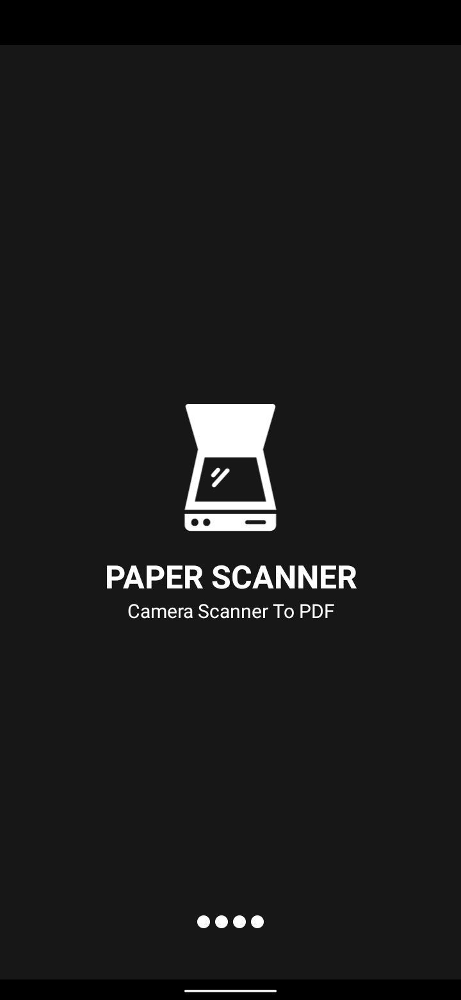
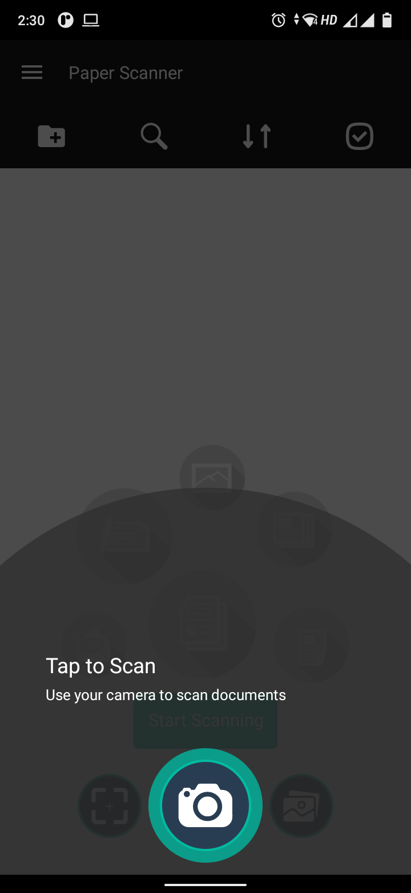
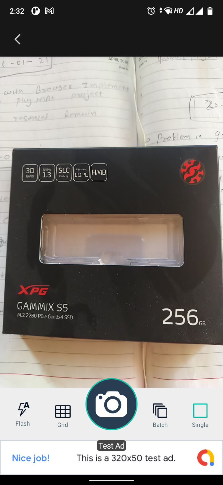
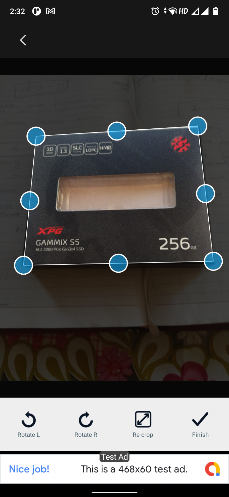
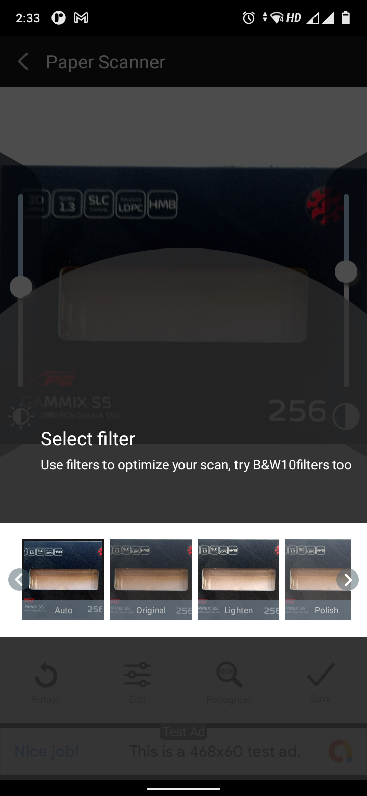
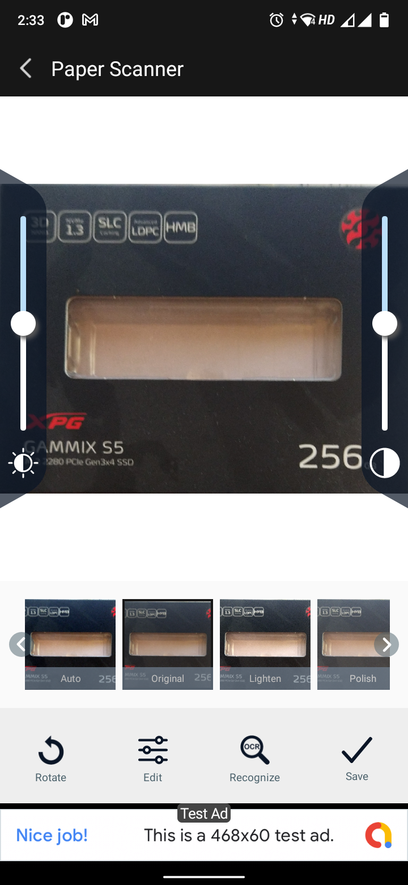
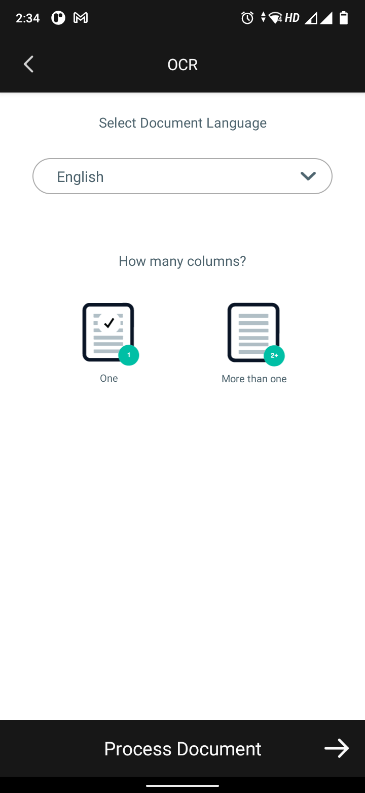
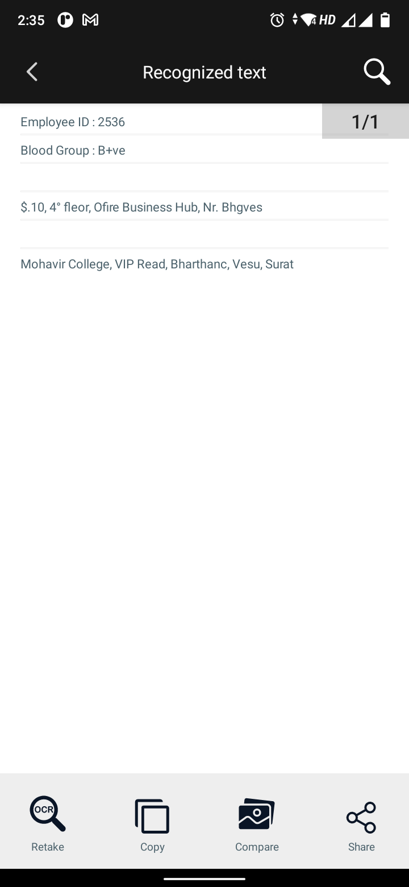
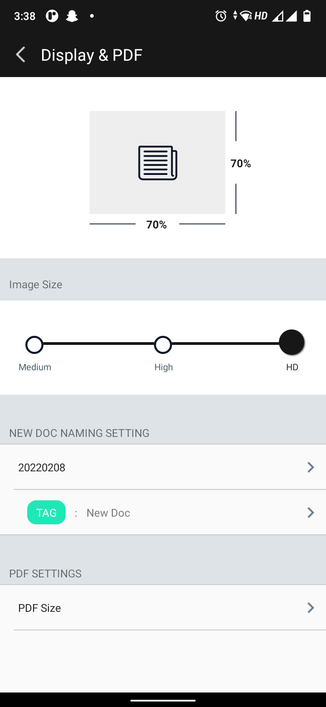
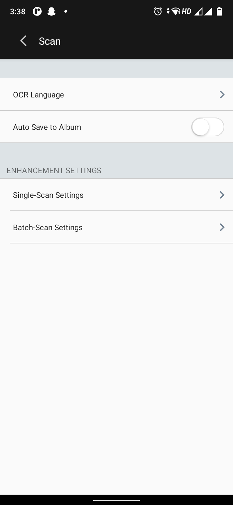

# Document Scanner

This app turns your mobile into a portable scanner, which can be used for scanning handwritten notes and printed documents.

It automatically detect the edge of the paper over a contrasting surface. When using the printed special page template it automatically detects the QR Code printed on the bottom right corner and scans the page immediately. After the page is detected, it compensates any perspective from the image adjusting it to a 90 degree top view and saves it on a folder on the device.

It also incorporates OCR functionality which the user can use to detect text from documents and save them as editable text files in the external storage of the device.

It is  possible to launch the application from any other application that asks for a picture.

## Features

* Scan handwritten or printed documents
* Detects page frame and corrects perspective
* Fast and smooth Image Processing on the fly
* Scans are saved to your device as images
* Detect text using the OCR functionality of the app
* Save the detected texts as editable text files to your device.
* Easily share scanned docs with others via social media, email attachment or sending the doc link.

## Screenshots

## Libraries
1. [OpenCV Android v3.1.0](http://opencv.org/platforms/android.html) for capturing and manipulation of images.
	Due to this version of OpenCV integerated in the app, it needs to run on Android 5.0 (lollipop) or newer. You can integrate a lower version of OpenCV like v2.4.3 if you want to run the app on devices below Android 5.0.
	
	### [How to integrate OpenCV into Android Studio](http://stackoverflow.com/questions/27406303/opencv-in-android-studio) 
	
	This stackoverflow link demonstrates the static initialization of OpenCV in Android Studio. The OpenCV native libraries are the main reason for the 38mb sized APK. To avoid this, you can make use of OpenCV Manager application which should to be installed on the android device so as to make OpenCV work.

#### Google Services:

2. [Google Zxing](https://github.com/zxing/zxing) for barcode detection and image processing.

3. [Google Mobile Vision Text API](https://developers.google.com/vision/) to see and understand text using OCR.

4. [Google Analytics](https://developers.google.com/analytics/devguides/collection/android/v4/) to measure user interaction with the app.

	If you want to use Google Analytics in your app, you'll require a configuration file.  You must have a Google Analytics account and a registered property to get the configuration file.
	

